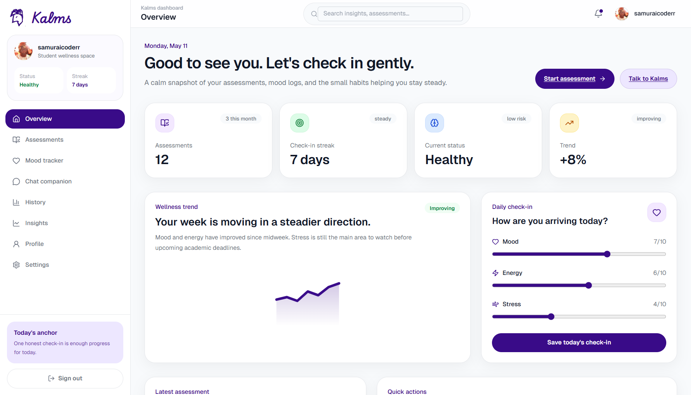
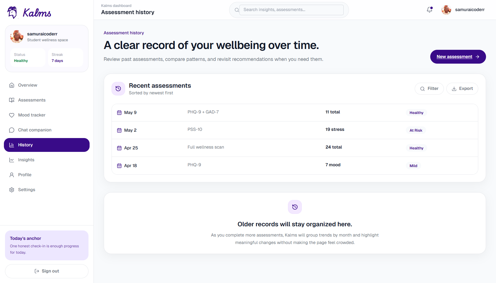
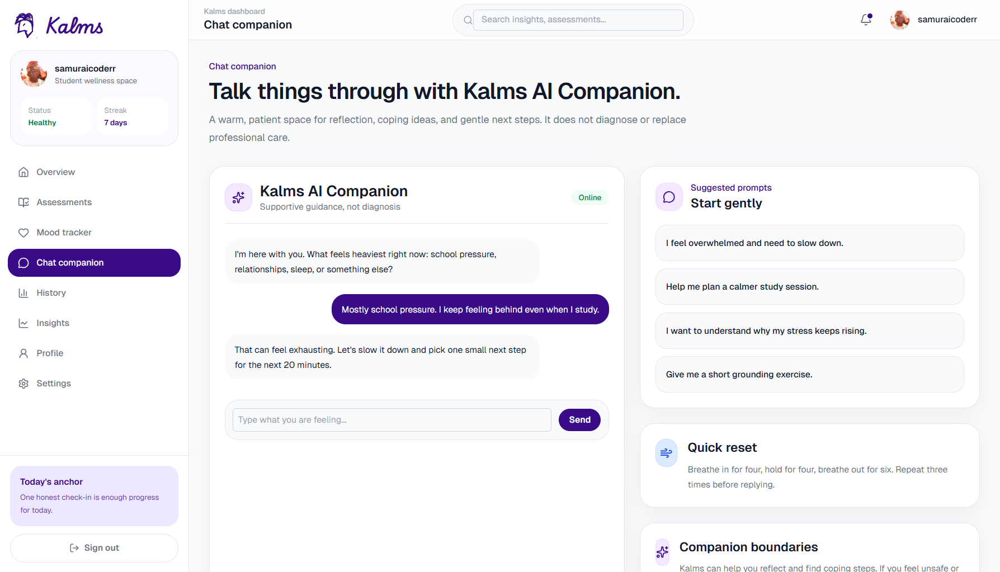

# Kalms

Kalms is an AI-powered student mental wellness platform that helps university users track mood, complete validated assessments, review historical wellbeing trends, and receive guided, compassionate support

> The platform is built as a full-stack app with a Next.js frontend and a Django backend.

## What this repo contains

- `frontend/` — Next.js 16 + React 19 + TypeScript UI and dashboard for students
- `backend/` — Django 4.2 REST and realtime API with Channels, Celery, Redis, and PostgreSQL support
- `.docs/` — project screenshots and visual references for the UI
- `requirements.md` — product requirements and feature scope for the mental health support platform

## Core features

- Guided mental health assessments: PHQ-9, GAD-7, PSS-10
- Mood tracking with daily check-ins for mood, energy, and stress
- Wellness trend visualizations and historical assessment history
- AI-backed prediction and recommendation engine for wellbeing support
- Supportive chat companion interface for reflective conversations
- User profile, settings, and non-diagnostic reassurance

## Tech stack

### Frontend
- Next.js
- React
- TypeScript
- Tailwind CSS
- Recharts
- Zustand

### Backend
- Python 3.12+ (project pins Python 3.14 in `backend/Makefile`)
- Django
- Django REST Framework
- Django Channels
- Celery
- PostgreSQL
- Redis
- Uvicorn / Daphne
- `uv` package manager

## Screenshots

Preview key UI pages from the project screenshots in `.docs`:

- `./.docs/dashboard_screenshot.png`
- `./.docs/assessment_tab_screenshot.png`
- `./.docs/chat_tab_screenshot.png`
- `./.docs/mood_tab_screenshot.png`
- `./.docs/insights_tab_screenshot.png`
- `./.docs/settings_tab_screenshot.png`
- `./.docs/user_profile_tab_screenshot.png`

### Sample screenshots







## Getting started

### Backend

1. Open a terminal and go to the backend folder:
   ```bash
   cd backend
   ```
2. Install Python dependencies using `uv`:
   ```bash
   make install
   ```
3. Create or update your `.env` file with required values.
   Example values may include:
   ```env
   DOMAIN=your-domain.com
   DOCKER_EMAIL=you@example.com
   COMPOSE_FILE=docker-compose.yaml
   ```
4. Apply database migrations:
   ```bash
   make migrate
   ```
5. Start the Django development server:
   ```bash
   make runserver
   ```
6. The backend will be available at:
   ```
   http://127.0.0.1:9000
   ```

### Frontend

1. Open a terminal and go to the frontend folder:
   ```bash
   cd frontend
   ```
2. Install Node dependencies:
   ```bash
   make install
   ```
3. Start the frontend development server:
   ```bash
   make runserver
   ```
4. The frontend will be available at:
   ```
   http://localhost:3000
   ```

### Run both together from the repository root

From the repository root, you can start both services using:
```bash
make runserver
```

## Useful commands

### Backend
- `make install` — install Python dependencies
- `make migrate` — run Django migrations
- `make runserver` — start the Django dev server
- `make shell` — open Django shell
- `make superuser` — create admin user
- `make uvicorn` — run ASGI server with Uvicorn
- `make daphne` — run ASGI server with Daphne

### Frontend
- `make install` — install Node dependencies
- `make runserver` — start Next.js dev server
- `npm run build` — build production frontend

## Notes

- The root `Makefile` is configured to start both the frontend and backend from the repository root.
- The backend is intended to use `uv` for dependency management, following the repository conventions.
- This application is designed as a supportive wellness tool and is not a medical diagnosis system.
